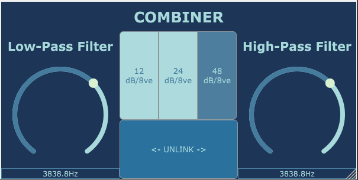

# Combiner
Combiner is a VST plug-in for combining low-frequency information from one input signal and high-frequency information from another. 

# Motivation
Split-band processing is an important technique in any audio engineer's toolbelt, where a single input source is 'split' into multiple frequency band which can be individually processed and recombined later. The premise for Combiner is the opposite: given multiple full-range input signals, combine only one frequency band from each to produce a single output signal.  
  
This process can be useful, for example, to blend a clean DI track and a distorted amp track from a bass guitar performance. While the same effect could be achieved using a low-pass and a high-pass filter on each of the respective tracks, Combiner provides the convenience of having both filters contained in a single plug-in, and, in 'Linked Mode' allows the engineer to adjust both filters with a single control.

# Screenshot

# Setup & Installation
## Building From Source
### Pre-Requisites
- The simplest way to build this project from source is to use an IDE that is supported by JUCE (XCode, Visual Studio 2015/2017/2019 or Code::Blocks). Refer to their respective websites for setup instruction.
- JUCE can be found on their [website](https://juce.com/get-juce). For additonal guidance with the setup instructions can be found in the [JUCE documentation](https://docs.juce.com/master/tutorial_new_projucer_project.html).
### Building
1. Open [Combiner.jucer](Combiner.jucer) located at the root of this repository in Projucer.
2. Expand the Modules tab and ensure that the following modules are present:
   - juce_audio_basics
   - juce_audio_devices
   - juce_audio_formats
   - juce_audio_plugin_client
   - juce_audio_processors
   - juce_audio_utils
   - juce_core
   - juce_data_structures
   - juce_events
   - juce_graphics
   - juce_gui_basics
   - juce_gui_extra
3. If any are absent, use the '+' button in the Modules panel and locate the files on your device to add them.
4. Launch the project in your IDE, and it will be configured to build the project.
5. Set the build target to VST3 to build as a plugin.

# Running
Once the project is built as a VST, simply located the 'Combiner.vst3' file in your 'Builds' directory and move it to a path that is visible to your DAW.

# Future Developments
- Undo/Redo is currently not implemented.
- Gain sliders and mute/solo/flip polarity buttons will be added for each input.
- An output level control will also be added.
- The graphics on the UI need an overhaul.

# Known Issues
- The plugin can become unstable if parameters are varied violently during playback. This can result in pops/clicks and crashes. Smoothing these transitions will be fixed in a future update.
- The plugin currently only accepts two stereo/dual-mono inputs and a single stereo/dual-mono output. A future update will add mono support for DAWs that don't default to dual-mono.
- Some combinations of plugin size and resolution can result in small misalignments in the UI.

# License
[GNU GPL](./LICENSE)
